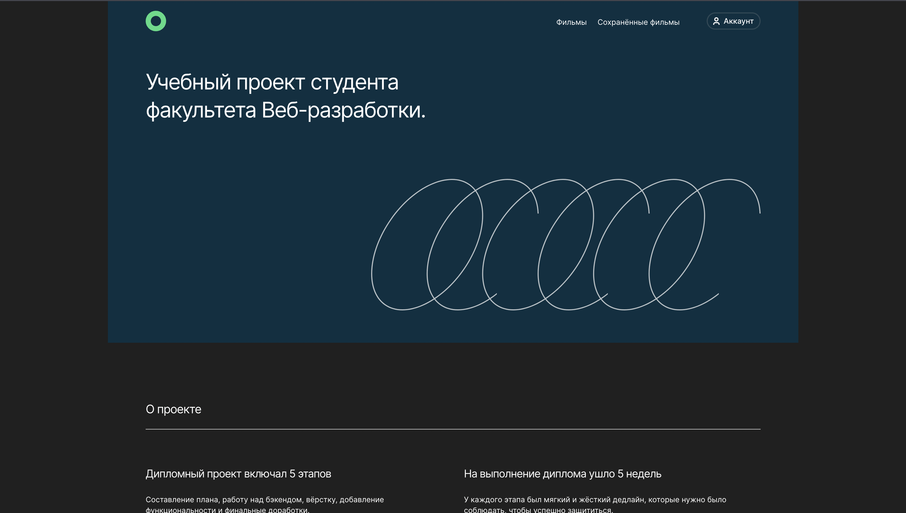

# Фильмы (Movies) - Frontend

## Описание проекта:

Дипломная работа в Яндекс.Практикум

Сервис, в котором можно найти фильмы по запросу и сохранить в личном кабинете.

Проект расположен по адресу https://shamanskiy.diploma.nomoredomains.work

Макет в **Figma** можно скачать с [Яндекс.Диск](https://yadi.sk/d/c-BipWYdCCPnFw "Макет в Figma ")

#### В проекте используются два бэкенда:

- [MoviesExplorer](https://api.nomoreparties.co/beatfilm-movies) — сервис поиска фильмов по ключевым словам. Предоставлен Яндексом.
- [API для аутентификации пользователей и сохранения фильмов](https://github.com/DenisShamanskiy/movies-explorer-api). Часть дипломной работы.

## Как это работает?

Пользователь вводит в строку поиска ключевые слова и нажимает кнопку «Искать». После этого сайт выполняет следующие действия:

- отправляет запрос к сервису Яндекса с данными о фильмах, получает данные и сохраняет
- согласно выбранному жанру находит все подходящие фильмы и отображает карточки с ними
- когда пользователь сохраняет фильм, он должен отображаться в специальном разделе сайта

### Сайт состоит из нескольких страниц:

- Главная. Содержит информацию о выполненном проекте.
- Страница с фильмами. На ней есть форма поиска фильмов и блок с результатами поиска
- Страница с сохранёнными фильмами. Показывает фильмы, сохранённые пользователем
- Страница регистрации. Позволяет пользователю зарегистрировать аккаунт
- Страница авторизации. На ней пользователь может войти в систему
- Страница редактирования профиля. Пользователь может изменить данные своего аккаунта
